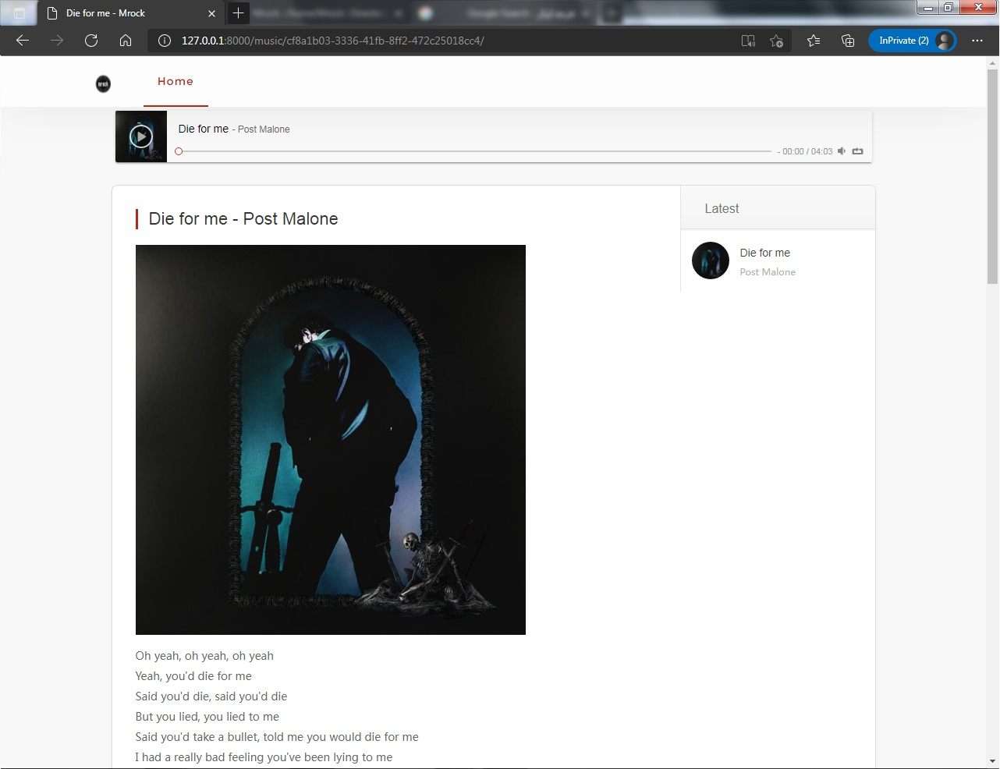

# Mrock
A simple djagno music website.
I used [this](https://github.com/iHaPBoy/music-website) template and I translated it to eng.
Also some changes commited.
 
My Live Domo : https://mrock.pythonanywhere.com/

# How to run?
1. git clone https://github.com/AnonC0DER/Mrock_django_music_project.git

2. cd Mrock_django_music_project

3. python3 manage.py createsuperuser 
**Enter your username and password**

4. python manage.py runserver 
**open 127.0.0.1:8000 in your browser**

5. Admin Panel : 127.0.0.1:8000/admin 
**Enter your username and password**

6. Now your can upload your musics

# Files
All musics and thumbnails are upload [here](https://github.com/AnonC0DER/Mrock_django_music_project/tree/master/static/media)
 
Main template, navbar and pagination are [here](https://github.com/AnonC0DER/Mrock_django_music_project/tree/master/templates)
 
Settings, main urls and etc are [here](https://github.com/AnonC0DER/Mrock_django_music_project/tree/master/Mrock)
 
Home, single music, category pages and main models are [here](https://github.com/AnonC0DER/Mrock_django_music_project/tree/master/Home)
 
Css, html, js and some images are [here](https://github.com/AnonC0DER/Mrock_django_music_project/tree/master/static/assets)
 

# Screenshots

